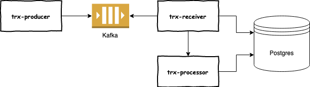

# Infrastructure DevOps

## Описание проекта

Есть условный платежный шлюз, через который идет поток транзакций.
Этот поток транзакций попадает в очередь, которую слушает сервис.
Слушатель очереди сохраняет все транзакции в БД, а на некоторые транзакции обрабатывает,
начисляет комиссию, баллы лояльности и т.д.

Проект состоит из 3х сервисов и визуально выглядит следующим образом:

В качестве мока платежного шлюза на схеме изображен сервис `trx-producer`,
который будет генерировать транзакции и складывать в очередь. Для увеличения 
нагрузки можно поднять несколько инстанцов сервиса. 

Прослушкой очереди занимается сервис `trx-receiver`. Его роль:
1) записать все пришедшие транзакции в БД
2) отправить часть транзакций на обработку в сервис `trx-processor`

Сервис `trx-processor` представляет собой простой REST сервис, 
содержащий контроллер с методами получения транзакций и бизнес логику обработки 
полученных транзакций. Обработанные транзакции сервис так же сохраняет в БД.

